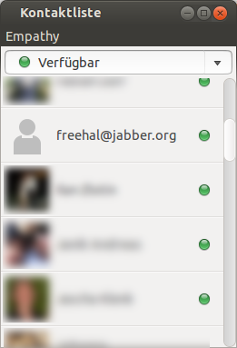

# Download

There are no precompiled versions of FreeHAL available - you have to download the source code from GitHub (@freehal) and compile them on your own.

## How to set up FreeHAL as an XMPP Client

  This tutorial takes you through the steps of setting up your own Freehal instance and connecting it to an XMPP server.
It was tested on Ubuntu 12.10 (64-bit) but should work with all descendants of Debian.
However, the software may be installed on most operating systems, including Windows, Mac and Linux.

  This way you can talk with your local Freehal copy with any instant messenger that supports Jabber/XMPP.
As the XMPP protocol is also used by Facebook and Google Talk, you can also use Freehal to connect to Facebook or Google+
and let it answer incoming chat messages.

  You can find the source code in the following Github repositories:

* <http://github.com/freehal/freehal-core>
* <http://github.com/freehal/freehal-android>
* <http://github.com/freehal/freehal-cxx>

First install [Git](http://help.github.com/articles/set-up-git), [Ant](http://ant.apache.org/) and
[Java 8 (JDK)](http://www.oracle.com/technetwork/java/javase/downloads/jdk8-downloads-2133151.html)
if you haven't done so already. If you are using Debian, Ubuntu or another Debian-compatible distribution, you need to install the following packages:


sudo apt-get install git ant openjdk-7-jdk


  Then open a shell and navigate to a directory where you want to install Freehal. Use the `git` command to clone the
[freehal-core](http://github.com/freehal/freehal-core)
repository:


git clone git://github.com/tobiasschulz/freehal-core.git


  This will download a full copy of the source code into a directory named `freehal-core`.
Use [ant](http://ant.apache.org/) to compile it:


cd freehal-core
ant


If the build was successful, there should be a file called `dist/freehal-dist.jar` which contains the compiled class files.

Now you can try to start Freehal:


java -jar $DIR/freehal-core/dist/freehal-dist.jar \\
    --base $DIR/freehal-core/ --language de \\
    --xmpp --xmpp-host jabber.org --xmpp-user freehal@jabber.org --xmpp-password [...]


  Replace `$DIR` with the directory which contains the `freehal-dist` directory created by git,
and replace `freehal@jabber.org` and `jabber.org` with your Jabber-ID and the corresponding XMPP server.
If you want Freehal to connect to Google+ or Facebook, use `talk.google.com` or `chat.facebook.com` as host name and your email address as user name.

  **Attention:** We recommend not to provide the XMPP password as a command-line argument but to store it in a configuration file.
Otherwise it is visible in the process list printed by `ps aux`, for example. You should create a file called `.freehalrc` in your home directory and
remove the read permission for everyone but yourself:


echo "xmpp-password = MyPassword" > ~/.freehalrc
chmod 0600 ~/.freehalrc


You can also store other command line parameters in the configuration file, like `base` or `language`. For example `~/.freehalrc` could look like:


base = /home/username/freehal-core/
language = de
xmpp-user = exampleuser@gmail.com
xmpp-password = MyPassword
xmpp-host = talk.google.com


Then you can connect to Google+ by executing the following command:


java -jar /home/username/freehal-core/dist/freehal-dist.jar --xmpp


