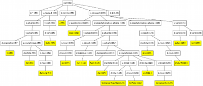

# About FreeHAL

The FreeHAL project's mission is to develop an open source computer program which very closely imitates human conversation. FreeHAL consists of a server application and several frontends, a cross-platform GUI and a web interface.

<!--
You can find the source code in the following Github repositories of Tobias Schulz (@tobiasschulz):

* <https://github.com/tobiasschulz/freehal-core>
* <https://github.com/tobiasschulz/freehal-android>
* <https://github.com/tobiasschulz/freehal-cxx>
-->

  If you are looking for the source code, the bug tracker and other information regarding the development of FreeHAL,
please go to [Github](https://github.com/freehal) where the current development happens. You can also find out more about FreeHAL at our
[Wikipedia](http://en.wikipedia.org/wiki/FreeHAL) and [Facebook](http://www.facebook.com/FreeHAL) page.

**After more than 6 years of (mostly) active development, the project has been discontinued in 2012.**

The source code is available under the [Gnu GPL v3](license.html), or any later version.

## Try it out

  Freehal can be installed on most operating systems, including Windows, Mac and Linux. If you use Linux, please follow
[this tutorial](download.html) to compile the source code.

  Since June 2012 there is also an Android App for smartphones and tablets in the
[Google Play](http://play.google.com/store/apps/details?id=net.freehal.app) store.
It uses our servers for computing the answer, but we plan to provide an native port for
Android devices too. Please note that this App still can be quite unstable, so don't give us
a bad rating if it crashes or doesn't work as expected.

  Since September 2012 we are working on a Java port of FreeHAL which could be used by future versions
of the Android app as well as by the desktop application.

  You can also see a lot of information about how Freehal analyses sentences at our
<a href="http://www.tobias-schulz.eu/demo-grammar" title="Grammar Demo">Grammar Demo</a>.
This is currently only available in German.

 

## BOINC and FreeHAL@home

  FreeHAL@home is the corresponding BOINC project which generates and converts fact and relationship databases (semantic networks) for FreeHAL.
Because these tasks take a lot of time and can be processed on many independent computers,
they are sent to volunteers donating CPU time by running the BOINC software.

  If you want to know more about the project stats of FreeHAL@home, please refer to
[Boincstats](http://boincstats.com/stats/project_graph.php?pr=freehal)
or, if the servers are offline or you are getting trouble with the BOINC software, look at the
[SETI.Germany](http://www.seti-germany.de/forum/freehal/3041-serverstatus-fragen-usw-82.html#post215354) forum
or the [Planet 3DNow!](http://www.planet3dnow.de/vbulletin/showthread.php?p=4589871#post4589871) forum
where I've posted some more details.

The Project URL to use in your BOINC client is <http://www.freehal.net/freehal_at_home/>.
